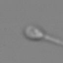

# MHSMA: The Modified Human Sperm Morphology Analysis Dataset

The MHSMA dataset is a collection of human sperm images from 235 patients with male factor infertility.
Each image is labeled by experts for normal or abnormal sperm acrosome, head, vacuole, and tail.

The training, validation, and test sets contain 1000, 240, and 300 images, respectively.

Images are available in two different crop sizes: 128x128- and 64x64-pixel.
The following figure shows two versions of the same instance.

| 128x128-pixel                                    | 64x64-pixel                                    |
| :----------------------------------------------: | :--------------------------------------------: |
|  |  |

In MHSMA, each instance is a grayscale image capturing a single sperm.
The head of the sperm is roughly located at the center of the image.
Also, the sperm tail is not entirely visible in the images.

Labels can be either `0` (normal, positive) or `1` (abnormal, negative).

The dataset is available in `.npy` format.
You can load the `.npy` files using [numpy.load](https://docs.scipy.org/doc/numpy/reference/generated/numpy.load.html).
The details of the files are described in the table below.

| File                   | Shape              | Type    | Description                           |
| ---------------------- | ------------------ | ------- | ------------------------------------- |
| `x_128_train.npy`      | `(1000, 128, 128)` | `uint8` | Training set, 128x128-pixel version   |
| `x_128_valid.npy`      | `(240, 128, 128)`  | `uint8` | Validation set, 128x128-pixel version |
| `x_128_test.npy`       | `(300, 128, 128)`  | `uint8` | Test set, 128x128-pixel version       |
| `x_64_train.npy`       | `(1000, 64, 64)`   | `uint8` | Training set, 64x64-pixel version     |
| `x_64_valid.npy`       | `(240, 64, 64)`    | `uint8` | Validation set, 64x64-pixel version   |
| `x_64_test.npy`        | `(300, 64, 64)`    | `uint8` | Test set, 64x64-pixel version         |
| `y_acrosome_train.npy` | `(1000,)`          | `uint8` | Training set labels for acrosome      |
| `y_acrosome_valid.npy` | `(240,)`           | `uint8` | Validation set labels for acrosome    |
| `y_acrosome_test.npy`  | `(300,)`           | `uint8` | Test set labels for acrosome          |
| `y_head_train.npy`     | `(1000,)`          | `uint8` | Training set labels for head          |
| `y_head_valid.npy`     | `(240,)`           | `uint8` | Validation set labels for head        |
| `y_head_test.npy`      | `(300,)`           | `uint8` | Test set labels for head              |
| `y_vacuole_train.npy`  | `(1000,)`          | `uint8` | Training set labels for vacuole       |
| `y_vacuole_valid.npy`  | `(240,)`           | `uint8` | Validation set labels for vacuole     |
| `y_vacuole_test.npy`   | `(300,)`           | `uint8` | Test set labels for vacuole           |
| `y_tail_train.npy`     | `(1000,)`          | `uint8` | Training set labels for tail          |
| `y_tail_valid.npy`     | `(240,)`           | `uint8` | Validation set labels for tail        |
| `y_tail_test.npy`      | `(300,)`           | `uint8` | Test set labels for tail              |

The following table shows the number of positive and negative examples in the dataset.

<table>
  <thead>
    <tr>
      <th>Set</th>
      <th>Label</th>
      <th># Positive</th>
      <th># Negative</th>
      <th>% Positive</th>
    </tr>
  </thead>
  <tbody>
    <tr>
      <td rowspan="4">Whole dataset</td>
      <td>Acrosome</td>
      <td>1,086</td>
      <td>454</td>
      <td>70.52</td>
    </tr>
    <tr>
      <td>Head</td>
      <td>1,122</td>
      <td>418</td>
      <td>72.86</td>
    </tr>
    <tr>
      <td>Vacuole</td>
      <td>1,301</td>
      <td>239</td>
      <td>84.48</td>
    </tr>
    <tr>
      <td>Tail</td>
      <td>1,471</td>
      <td>69</td>
      <td>95.52</td>
    </tr>
    <tr>
      <td rowspan="4">Training set</td>
      <td>Acrosome</td>
      <td>699</td>
      <td>301</td>
      <td>69.90</td>
    </tr>
    <tr>
      <td>Head</td>
      <td>727</td>
      <td>273</td>
      <td>72.70</td>
    </tr>
    <tr>
      <td>Vacuole</td>
      <td>830</td>
      <td>170</td>
      <td>83.00</td>
    </tr>
    <tr>
      <td>Tail</td>
      <td>954</td>
      <td>46</td>
      <td>95.40</td>
    </tr>
    <tr>
      <td rowspan="4">Validation set</td>
      <td>Acrosome</td>
      <td>174</td>
      <td>66</td>
      <td>72.50</td>
    </tr>
    <tr>
      <td>Head</td>
      <td>176</td>
      <td>64</td>
      <td>73.33</td>
    </tr>
    <tr>
      <td>Vacuole</td>
      <td>209</td>
      <td>31</td>
      <td>87.08</td>
    </tr>
    <tr>
      <td>Tail</td>
      <td>233</td>
      <td>7</td>
      <td>97.08</td>
    </tr>
    <tr>
      <td rowspan="4">Test set</td>
      <td>Acrosome</td>
      <td>213</td>
      <td>87</td>
      <td>71.00</td>
    </tr>
    <tr>
      <td>Head</td>
      <td>219</td>
      <td>81</td>
      <td>73.00</td>
    </tr>
    <tr>
      <td>Vacuole</td>
      <td>262</td>
      <td>38</td>
      <td>87.33</td>
    </tr>
    <tr>
      <td>Tail</td>
      <td>284</td>
      <td>16</td>
      <td>94.67</td>
    </tr>
  </tbody>
</table>

## Results

If you would like to add a new result, you can [open a pull request](https://github.com/soroushj/mhsma-dataset/pulls).

<table>
  <thead>
    <tr>
      <th>Method</th>
      <th>Label</th>
      <th>Accuracy</th>
      <th>Precision</th>
      <th>Recall</th>
      <th>F<sub>0.5</sub> score</th>
      <th>G-mean</th>
      <th>AUC</th>
      <th>MCC</th>
    </tr>
  </thead>
  <tbody>
    <tr>
      <td rowspan="3"><a href="https://doi.org/10.1016/j.compbiomed.2019.04.030">A novel deep learning method for automatic assessment of human sperm images</a> (Apr 2019)</td>
      <td>Acrosome</td>
      <td>76.67</td>
      <td>85.93</td>
      <td>80.28</td>
      <td>84.74</td>
      <td>83.06</td>
      <td>83.89</td>
      <td>+0.4618</td>
    </tr>
    <tr>
      <td>Head</td>
      <td>77.00</td>
      <td>83.48</td>
      <td>85.39</td>
      <td>83.86</td>
      <td>84.43</td>
      <td>77.80</td>
      <td>+0.4053</td>
    </tr>
    <tr>
      <td>Vacuole</td>
      <td>91.33</td>
      <td>94.36</td>
      <td>95.80</td>
      <td>94.65</td>
      <td>95.08</td>
      <td>88.08</td>
      <td>+0.5910</td>
    </tr>
  </tbody>
</table>

## Citation

If you use this dataset in your research, please kindly cite [our work](https://doi.org/10.1016/j.compbiomed.2019.04.030) as:

```bibtex
@article{javadi2019novel,
  title={A novel deep learning method for automatic assessment of human sperm images},
  author={Javadi, Soroush and Mirroshandel, Seyed Abolghasem},
  journal={Computers in Biology and Medicine},
  year={2019},
  doi={10.1016/j.compbiomed.2019.04.030}
}
```

## License

This dataset is made available under the [CC BY-NC-SA 4.0](https://creativecommons.org/licenses/by-nc-sa/4.0/) license.

## Credits

MHSMA is based on the Human Sperm Morphology Analysis Dataset (HSMA-DS) [(Ghasemian et al., 2015)](https://doi.org/10.1016/j.cmpb.2015.08.013).
